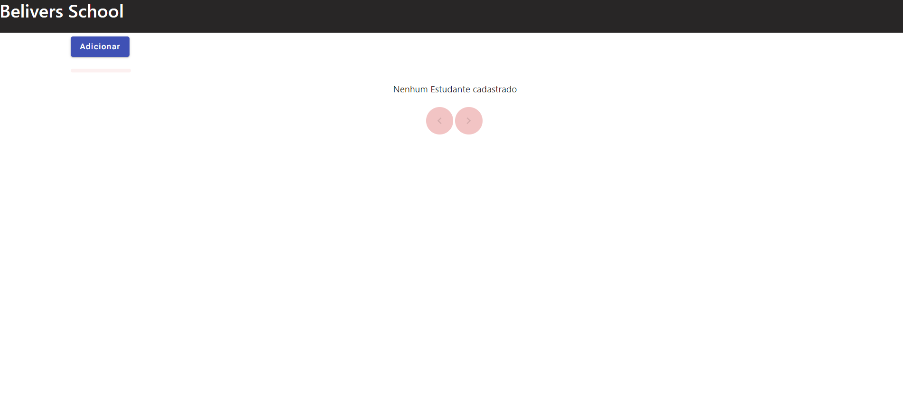
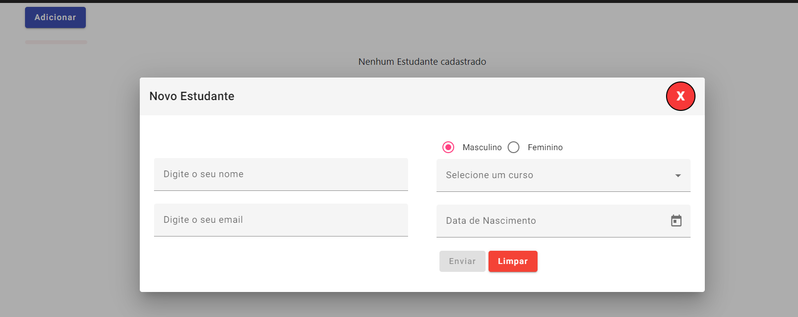
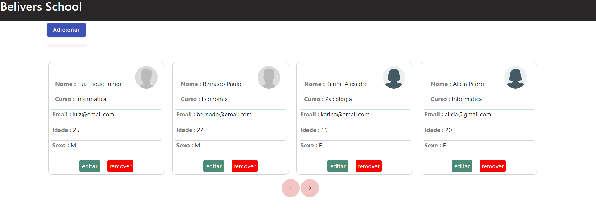

# Angular-Spring Boot App

  Projecto Fullstack com as funcionalidades de crud no lado do cliente e do servidor
  

## ✔️ Técnicas e tecnologias utilizadas

- ``Java 17``
- ``Spring Boot``
- ``Angular 15``
- ``Angular Material``
- ``H2 Database``
- ``maven``

## 📁 Acesso ao projecto local
- Clone este repositorio ou baixe o arquivo .zip;

## 🛠️ Abrir e rodar o projecto

## Para  o backend
- Abrir o projecto na sua IDE favorita java;
- executar o comando `cd /backend` no terminal
- executar o comando `mvn clean install` no terminal;

## Para  o frontend
- Abrir o projecto na sua IDE favorita web;
- executar o comando `cd /frontend` no terminal
- executar o comando `npm install` no terminal;
- executar o comando `ng serve` no terminal;

### Colaborador

- [Luiz Tique Junior](https://www.linkedin.com/in/luiz-tique-j%C3%BAnior-154251229/)
